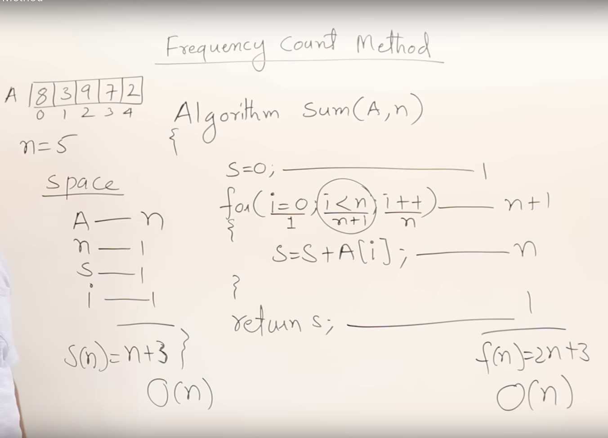

## Prior Analysis

1. Algorithm

2. Language independent

3. Hardware independent

4. Time and space function

## Posterior testing

1. Program

2. Language dependent

3. Hardware dependent

4. Watch time and bytes 

## Characteristics of algorithm

1. Input  - 0 or more

2. Output - at least 1

3. Definiteness  -    -1 invalid

4. Finiteness 

5. effectiveness

## How to analyze an algorithm

1. Time function

2. Space function

#### other ways to analyze an algorithm

1. Network consumption

2. Power

3. Cpu registers 

## frequency count method

## Type of time function

O(1)     -constant

O(logn)  -logrithmic 

O(n) linear

O(n2) quadratic

O(n3) cubic

O(2n) exponential

O(3n)

O(nn)

1<logn<n<n<nlogn <n2<n3 < .... <2n<3n ... <nn

Asymptomic notations 

O big-oh     upperbound

  big omega    lower bound  

  theta        Average bound

## Algorithm

- Design

- Domain knowledge

- Any lang

- hw& os independent

- Analyze

## Program

- Implementation

- Program

- Programmer

- Programming language

- Hw & os dependent 

- Testing

## 2. Spanning Tree

A spanning tree of an undirected graph G is a connected subgraph that covers all the graph nodes with the minimum possible number of edges. In general, a graph may have more than one spanning tree.

## Minimum Spanning Tree

If the graph is edge-weighted, we can define the weight of a spanning tree as the sum of the weights of all its edges. A minimum spanning tree is a spanning tree whose weight is the smallest among all possible spanning trees.

## Shortest Path Tree

In the shortest path tree problem, we start with a source node s.

For any other node v in graph G, the shortest path between s and v is a path such that the total weight of the edges along this path is minimized. Therefore, the objective of the shortest path tree problem is to find a spanning tree such that the path from the source node s to any other node v is the shortest one in G.

We can solve this problem with [Dijkstra’s algorithm](https://www.baeldung.com/java-dijkstra):

|E|C(|V|-1) -Number of cycle

## Time function

here , time function **f(n) =2n+3**

space complexity  **S(n) = n+3**

time complexity  **O(n)** 

## Huff man coding
